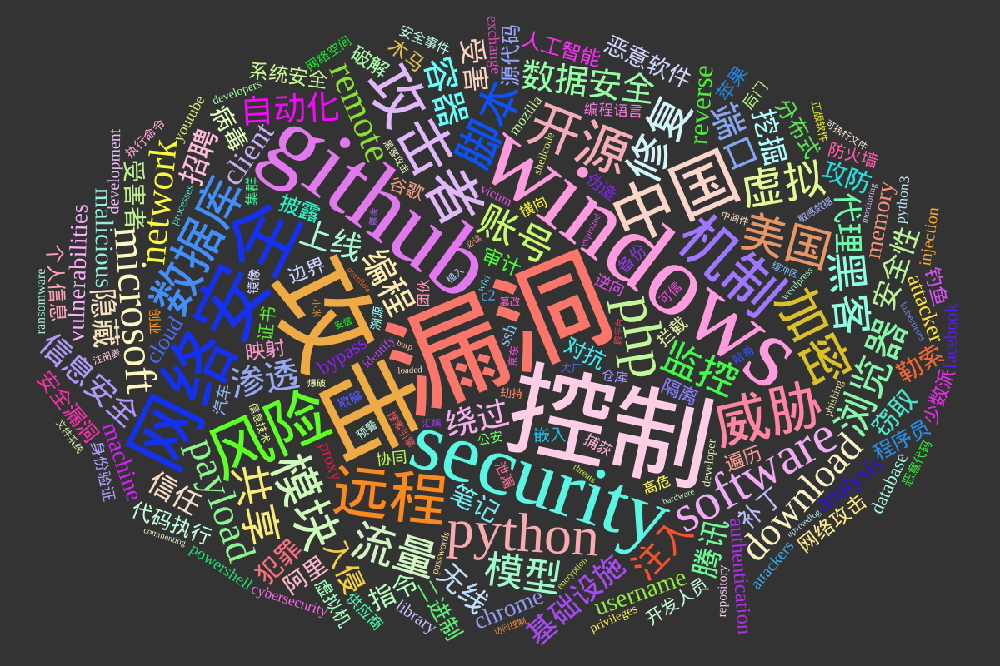
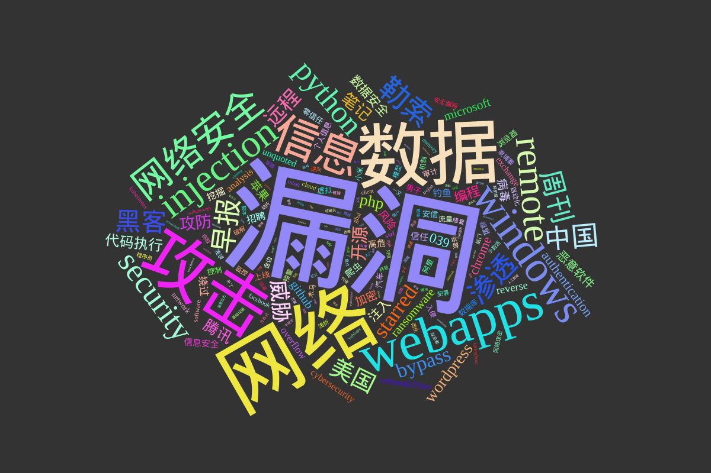

# 网络安全2021年词云







数据来源： [buaq.net](https://buaq.net) / [unsafe.sh](https://unsafe.sh) 去年采集的所有文章

## 数据情况
整个2021年一共采集了40268篇文章
```
mysql> select count(1) from notes where date like '2021%';
+----------+
| count(1) |
+----------+
|    40268 |
+----------+
1 row in set (0.03 sec)


mysql> select count(1) from notes where date like '2020%';
+----------+
| count(1) |
+----------+
|    26395 |
+----------+


```

对比2020年有52%的增长

### 阅读量对比

```
2010年阅读量

mysql> select sum(view) from notes where date like '2020%';
+-----------+
| sum(view) |
+-----------+
|   5814483 |
+-----------+

2021年阅读量

mysql> select sum(view) from notes where date like '2021%';
+-----------+
| sum(view) |
+-----------+
|   3631612 |
+-----------+
1 row in set (0.04 sec)
```

44%的下滑，因为调整了代码

## top50 
2021 按照阅读量排名最高的50篇文章是

| title                                                                                                                               | view  | date                |
| ----------------------------------------------------------------------------------------------------------------------------------- | ----- | ------------------- |
| CVE-2021-26855 Exchange Server RCE 复现                                                                                             | 12131 | 2021-03-14 00:49:50 |
| CVE-2021-21972 vCenter 6.5-7.0 RCE 漏洞分析                                                                                         | 4843  | 2021-02-24 17:59:59 |
| VCSA 6.5-7.0 远程代码执行 CVE-2021-21985 漏洞分析                                                                                   | 3462  | 2021-06-05 09:17:00 |
| 【安全通报】Apache Log4j2 远程代码执行漏洞                                                                                          | 2502  | 2021-12-10 09:29:50 |
| 致远OA未授权漏洞复现和简单分析                                                                                                      | 1996  | 2021-01-10 15:04:44 |
| New Threat: ZHtrap botnet implements honeypot to facilitate finding more victims                                                    | 1952  | 2021-03-12 23:09:55 |
| code-scan starred CVE-2021-21975                                                                                                    | 1878  | 2021-04-01 20:21:49 |
| xiaoy-sec/Pentest_Note: 渗透测试常规操作记录                                                                                        | 1844  | 2021-02-23 15:29:12 |
| ThinkPHP v3.2.* （SQL注入&文件读取）反序列化POP链                                                                                   | 1694  | 2021-01-09 01:13:53 |
| Gafgtyt_tor，Necro作者再次升级“武器库”                                                                                              | 1521  | 2021-03-05 09:01:00 |
| C2 Traffic Patterns: Personal Notes                                                                                                 | 1345  | 2021-01-09 16:32:50 |
| SecWiki周刊(第361期)                                                                                                                | 1242  | 2021-02-01 11:18:46 |
| Cobalt Strike 4.3 – Command and CONTROL                                                                                             | 1195  | 2021-03-04 03:38:39 |
| Windows & Active Directory Exploitation Cheat Sheet and Command Reference :: Cas van Cooten — I ramble about security stuff, mostly | 1160  | 2021-03-10 00:05:02 |
| 和 Apple 一起共事是一种怎样的体验？                                                                                                 | 1157  | 2021-04-02 15:28:38 |
| IDA Pro 7.6 + HexRays Decompilers                                                                                                   | 1151  | 2021-08-03 16:28:26 |
| seeyon未授权访问漏洞导致getshell复现                                                                                                | 1131  | 2021-01-11 23:40:5 |
| Apache Druid RCE EXP (CVE-2021-25646)                                                                                               | 1102  | 2021-02-02 13:55:30 |
| Installer File TakeOver                                                                                                             | 1082  | 2021-11-22 17:00:48 |
| Apollo 配置中心未授权获取配置漏洞利用                                                                                               | 1065  | 2021-01-08 00:13:07 |
| Immunity Canvas 7.26 [Leaked Download]                                                                                              | 997   | 2021-03-05 12:37:41 |
| j1anFen/shiro_attack: shiro反序列化漏洞综合利用,包含（回显执行命令/注入内存马）                                                     | 978   | 2021-03-06 23:03:03 |
| New Exploit Development Course: EXP-301                                                                                             | 919   | 2021-01-27 21:17:05 |
| 2021HVV期间披露的漏洞分析(持续更新)                                                                                                 | 899   | 2021-04-09 11:16:05 |
| CVE-2021-26855：Exchange SSRF致RCE复现                                                                                              | 890   | 2021-03-18 11:12:05 |
| 用友NC历史漏洞(含POC)                                                                                                               | 852   | 2021-07-01 16:10:35 |
| Fliqlo – 时隔 10 年，翻页时钟屏保更新，不再需要 Flash                                                                               | 816   | 2021-01-12 15:52:58 |
| 实现自定义的 gin Logger 中间件                                                                                                      | 795   | 2021-01-08 23:33:12 |
| 蝙蝠（BatChat） – 这是一款宣称“国内版 Telegram”的加密聊天应用                                                                       | 790   | 2021-01-22 13:09:23 |
| Mobile Security: Reverse Engineer Android Apps From Scratch - Free Course From Udemy                                                | 759   | 2021-05-08 00:19:17 |
| Namecheap不讲武徳续费太贵，换成Porkbun                                                                                              | 750   | 2021-01-02 12:28:55 |
| nginx反向代理400绕过学习 - sevck                                                                                                    | 747   | 2021-12-08 12:25:00 |
| Active Directory PenTest Cheat Sheet - Lateral Movement & Persistence Techniques                                                    | 738   | 2021-05-15 00:43:00 |
| 【迅雷】应版权方要求 无法下载                                                                                                       | 734   | 2021-06-09 23:08:50 |
| 一日一技  让新版群晖 Video Station 正常播放带专利音轨                                                                               | 732   | 2021-04-26 15:28:09 |
| 星速浏览器 极速畅享全球互联网全球访问                                                                                               | 724   | 2021-04-20 20:13:54 |
| Threat Alert: Log4j Vulnerability Has Been adopted by two Linux Botnets                                                             | 714   | 2021-12-11 23:28:41 |
| Docker SYS_ADMIN 容器逃逸原理解析                                                                                                   | 709   | 2021-03-02 15:55:37 |
| rothgar/awesome-tmux: A list of awesome resources for tmux                                                                          | 691   | 2021-01-23 14:46:13 |
| Using curl for telnet testing on macOS High Sierra and later                                                                        | 690   | 2021-05-24 01:18:45 |
| 0412  Goby 红队专版漏洞同步更新情况                                                                                                 | 684   | 2021-04-13 11:49:42 |
| 红队重点攻击系统整理 - 渗透测试中心                                                                                                 | 683   | 2021-01-17 12:57:00 |
| CTF Collection Vol.1: TryHackMe Walkthrough                                                                                         | 683   | 2021-01-06 17:03:13 |
| HTB - You know 0xDiablos                                                                                                            | 679   | 2021-04-15 00:19:51 |
| Burp Suite 2021.6 破解版本                                                                                                          | 675   | 2021-06-13 10:44:42 |
| Apache Log4j任意代码执行漏洞安全风险通告第三次更新                                                                                  | 664   | 2021-12-10 13:07:01 |
| Microsoft Exchange Server Vulnerabilities Mitigations – March 2021                                                                  | 657   | 2021-03-06 07:01:30 |
| 记一次对thinkphp+宝塔的getshell尝试                                                                                                 | 637   | 2021-04-21 15:14:35 |
| 红色警戒2在线版，支持联机对战，录像回看                                                                                             | 630   | 2021-04-01 13:06:47 |
| java执行shellcode的几种方法                                                                                                         | 629   | 2021-04-15 16:31:24 |


## 年度关键词

所有文章里面提取出的关键词
```
❯ cat tags.txt|wc
4427329 13281987 57287958


# 排序去重复

cat tags.txt|awk '{print$1}'|sort|uniq -c |sort -nr > tags.nr.txt

# 去掉大词之后的top100

cat tags.nr.txt|head -n 100|awk '{print"|"$1"|"$2"|"}' 

```


| 次数 | 关键词 |
| ---- | ------ |
|漏洞|8132|
|攻击|7636|
|控制|7426|
|windows|7378|
|github|7059|
|security|6057|
|网络安全|5230|
|中国|4757|
|风险|4552|
|机制|4204|
|攻击者|4188|
|远程|4162|
|威胁|3993|
|php|3971|
|python|3961|
|开源|3754|
|software|3752|
|加密|3654|
|模块|3554|
|数据库|3521|
|美国|3265|
|脚本|3254|
|修复|3225|
|microsoft|3150|
|流量|3130|
|虚拟|3082|
|黑客|3076|
|共享|2978|
|浏览器|2929|
|payload|2905|
|download|2879|
|账号|2857|
|监控|2785|
|模型|2782|
|network|2773|
|remote|2710|
|容器|2573|
|编程|2508|
|渗透|2507|
|端口|2494|
|注入|2494|
|数据安全|2422|
|自动化|2371|
|绕过|2344|
|上线|2307|
|client|2208|
|代理|2206|
|信息安全|2177|
|腾讯|2176|
|隐藏|2173|
|基础设施|2132|
|无线|2075|
|安全性|2071|
|招聘|2069|
|入侵|2026|
|挖掘|2025|
|信任|2010|
|reverse|1999|
|受害|1990|
|窃取|1862|
|malicious|1862|
|犯罪|1856|
|指令|1840|
|笔记|1839|
|username|1805|
|攻防|1798|
|补丁|1779|
|勒索|1776|
|vulnerabilities|1746|
|chrome|1742|
|machine|1735|
|病毒|1721|
|受害者|1696|
|阿里|1694|
|analysis|1693|
|memory|1692|
|恶意软件|1672|
|cloud|1631|
|attacker|1621|
|二进制|1601|
|分布式|1574|
|对抗|1537|
|代码执行|1512|
|安全漏洞|1501|
|披露|1497|
|源代码|1493|
|审计|1487|
|authentication|1485|
|程序员|1471|
|人工智能|1465|
|网络攻击|1452|
|系统安全|1432|
|映射|1431|
|破解|1430|
|bypass|1427|
|木马|1425|
|钓鱼|1423|
|个人信息|1400|
|少数派|1379|
|边界|1367|


为了防止数据不准确，我把标题在拉出来做一个排名


其中top100的词如下

| 次数 | 关键词          |
| ---- | --------------- |
| 2131 | 漏洞            |
| 1392 | 网络            |
| 1204 | 数据            |
| 1139 | 攻击            |
| 915  | webapps         |
| 755  | 信息            |
| 743  | windows         |
| 658  | injection       |
| 648  | 网络安全        |
| 642  | remote          |
| 544  | security        |
| 525  | python          |
| 495  | 勒索            |
| 472  | 早报            |
| 469  | 渗透            |
| 464  | 中国            |
| 455  | 周刊            |
| 437  | 黑客            |
| 396  | 美国            |
| 371  | 威胁            |
| 365  | starred         |
| 349  | 远程            |
| 349  | bypass          |
| 299  | 开源            |
| 284  | wordpress       |
| 281  | 笔记            |
| 275  | 攻防            |
| 271  | php             |
| 262  | 腾讯            |
| 245  | 代码执行        |
| 231  | 039             |
| 230  | authentication  |
| 225  | 编程            |
| 225  | chrome          |
| 216  | 注入            |
| 213  | microsoft       |
| 212  | 数据安全        |
| 207  | ransomware      |
| 204  | github          |
| 202  | 恶意软件        |
| 198  | 病毒            |
| 194  | 苹果            |
| 194  | 加密            |
| 187  | reverse         |
| 182  | 风险            |
| 176  | 绕过            |
| 173  | overflow        |
| 165  | 招聘            |
| 164  | analysis        |
| 163  | unquoted        |
| 161  | cybersecurity   |
| 160  | 钓鱼            |
| 158  | 挖掘            |
| 152  | 高危            |
| 152  | 爬虫            |
| 152  | 信任            |
| 152  | vulnerabilities |
| 152  | exchange        |
| 148  | 信息安全        |
| 136  | 上线            |
| 134  | 汽车            |
| 133  | 审计            |
| 133  | 安信            |
| 132  | 男子            |
| 131  | 个人信息        |
| 130  | 零信任          |
| 129  | 浏览器          |
| 128  | network         |
| 127  | 虚拟            |
| 126  | 数据库          |
| 125  | 控制            |
| 124  | 阿里            |
| 122  | 流量            |
| 122  | 小米            |
| 120  | 绿盟            |
| 116  | 木马            |
| 116  | 入侵            |
| 115  | ssrf            |
| 113  | 机制            |
| 112  | 预警            |
| 112  | 模型            |
| 111  | cloud           |
| 109  | 自动化          |
| 109  | software        |
| 108  | 柬埔寨          |
| 108  | facebook        |
| 107  | ghsl            |
| 106  | 金边            |
| 106  | 谷歌            |
| 106  | 修复            |
| 105  | 监控            |
| 104  | 破解            |
| 103  | 安全漏洞        |
| 102  | kubernetes      |
| 99   | 犯罪            |
| 99   | 浅谈            |
| 96   | 网络攻击        |
| 96   | memory          |
| 95   | 浅析            |
| 94   | client          |  


